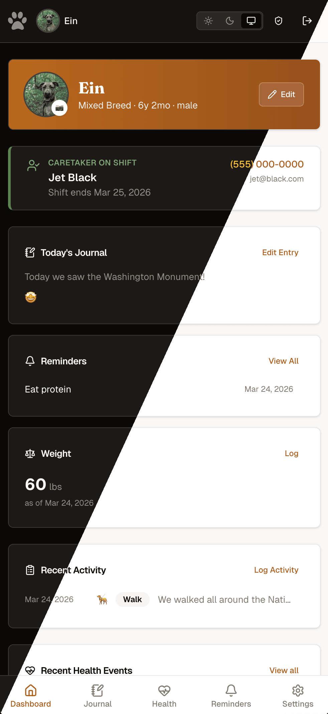

# 🐾 EinVault

[](LICENSE)

EinVault is a private, self-hosted companion health and care tracker built for homelabs. Track health records, daily activities, and care schedules for your animal companions. All data stays on your hardware. No cloud, no telemetry, no external accounts.

## Features

- **Companion profiles:** breed, bio, vet info, emergency contacts, and avatar photo
- **Daily journal:** per-companion entries with mood tracking and up to 5 photos per day
- **Health tracking:** vet visits, vaccinations, medications, procedures, and weight history
- **Activity logging:** walks, meals, bathroom trips, treats, play sessions, and grooming
- **Reminders:** recurring and one-time reminders for medications, vaccinations, grooming, and more
- **Caretaker shifts:** schedule work shifts and export to calendar via iCalendar (.ics)
- **Role-based access:** admins manage the app, members track health, caretakers log activities
- **Self-contained:** single Docker container, SQLite database, no external dependencies
- **Responsive UI:** works on desktop and mobile, with dark and light mode support

## Screenshots





[More screenshots](docs/SCREENSHOTS.md)

---

## Production (Docker)

Requires Docker Engine 24+, Docker Compose v2, and a reverse proxy for TLS (Caddy, Nginx, Traefik, or similar).

```bash
# 1. Create the data directory
mkdir -p ./data

# 2. Start (replace with your actual domain)
ORIGIN=https://einvault.yourdomain.com \
  docker compose -f docker-compose.prod.yml up -d
```

Open your domain in a browser and follow the `/setup` prompt to create your admin account.

To avoid passing `ORIGIN` every time, drop a `.env` file next to the compose file:

```bash
cp .env.example .env
# Edit .env and set ORIGIN
docker compose -f docker-compose.prod.yml up -d
```

### Reverse proxy

Two networking options are available depending on where your proxy runs.

#### Option A: host-level proxy (default)

The container binds to `127.0.0.1:3000`. Your proxy on the host forwards traffic there.

**Caddy:**

```caddyfile
einvault.yourdomain.com {
    reverse_proxy 127.0.0.1:3000
}
```

**Nginx:**

```nginx
server {
    listen 443 ssl;
    server_name einvault.yourdomain.com;

    location / {
        proxy_pass http://127.0.0.1:3000;
        proxy_set_header Host $host;
        proxy_set_header X-Real-IP $remote_addr;
        proxy_set_header X-Forwarded-For $proxy_add_x_forwarded_for;
        proxy_set_header X-Forwarded-Proto $scheme;
    }
}
```

**Traefik (static file provider):**

```yaml
# /etc/traefik/conf.d/einvault.yml
http:
  routers:
    einvault:
      rule: "Host(`einvault.yourdomain.com`)"
      entryPoints: [websecure]
      tls:
        certResolver: letsencrypt
      service: einvault
  services:
    einvault:
      loadBalancer:
        servers:
          - url: "http://127.0.0.1:3000"
```

#### Option B: Docker-network proxy

If your proxy runs as a Docker container (Traefik, Caddy, etc.), join EinVault to its network instead of binding a host port.

In `docker-compose.prod.yml`, swap the `ports` block for `expose` and `networks`:

```yaml
# Comment out:
# ports:
#   - "${EINVAULT_HOST:-127.0.0.1}:${EINVAULT_PORT:-3000}:3000"

# Uncomment:
expose:
  - "3000"
networks:
  - proxy   # must match your proxy container's network name
```

Also uncomment the `networks` block at the bottom of the file:

```yaml
networks:
  proxy:
    external: true
```

**Traefik (Docker provider)** - add these labels to the `einvault` service:

```yaml
labels:
  - "traefik.enable=true"
  - "traefik.http.routers.einvault.rule=Host(`einvault.yourdomain.com`)"
  - "traefik.http.routers.einvault.entrypoints=websecure"
  - "traefik.http.routers.einvault.tls.certresolver=letsencrypt"
  - "traefik.http.services.einvault.loadbalancer.server.port=3000"
```

**Caddy (Docker provider):**

```caddyfile
einvault.yourdomain.com {
    reverse_proxy einvault:3000
}
```

### Configuration

Only `ORIGIN` is required. Everything else works out of the box.

**Required:**

| Variable | Description |
|---|---|
| `ORIGIN` | Public URL of your instance (e.g. `https://einvault.yourdomain.com`). Used by SvelteKit for CSRF validation on form submissions. |

**Optional:**

| Variable | Default | Description |
|---|---|---|
| `PUID` | `1000` | UID the container runs as. Match to your `./data` directory owner. |
| `PGID` | `1000` | GID the container runs as. |
| `EINVAULT_DATA` | `./data` | Host path for the data directory (database and uploads). |
| `EINVAULT_HOST` | `127.0.0.1` | Host interface to bind to (Option A only). |
| `EINVAULT_PORT` | `3000` | Host port to expose (Option A only). |
| `UPLOAD_MAX_MB` | `10` | Max file size in MB for avatar and journal photo uploads. If you raise this above 50, raise `BODY_SIZE_LIMIT` to match. |
| `BODY_SIZE_LIMIT` | `50M` | SvelteKit's internal request body cap. Must be at least as large as `UPLOAD_MAX_MB`. See note below. |
| `DATABASE_URL` | `/data/einvault.db` | Database path inside the container. Unlikely to need changing. |

> **`BODY_SIZE_LIMIT` and `UPLOAD_MAX_MB`:** SvelteKit enforces its own body size limit before the upload handler runs, so it has to be set high enough to let requests through. `UPLOAD_MAX_MB` is the application-level gate (what users actually see); `BODY_SIZE_LIMIT` is the framework ceiling that just needs to stay out of the way. The default of `50M` covers `UPLOAD_MAX_MB` values up to 50. Accepts `K`, `M`, and `G` suffixes.

### Data and backup

Data lives in `./data` on the host (or `EINVAULT_DATA` if set). Create it before starting so you control the ownership:

```bash
mkdir -p ./data
# If using a custom PUID/PGID:
chown 1001:1001 ./data
```

**Backup:**

```bash
# Copy the directory (stop the container first for a clean snapshot)
cp -r ./data ./data.bak

# Or use SQLite's online backup while the container is running
docker exec einvault sqlite3 /data/einvault.db ".backup '/data/einvault.backup.db'"
```

### Container hardening

| | |
|---|---|
| Runs as root | No (runs as `node`, UID 1000) |
| `no-new-privileges` | Enabled |
| Linux capabilities | All dropped |
| Root filesystem | Read-only |
| Writable `/tmp` | tmpfs, 64 MB |
| CPU limit | 0.5 cores |
| Memory limit | 256 MB |

### Image tags

| Tag | Description |
|---|---|
| `latest` | Latest stable release |
| `x.y.z` | Pinned release |

---

## Docker (local build)

Builds the image locally instead of pulling from GHCR. Useful for testing Dockerfile changes or working on EinVault itself:

```bash
docker compose -f docker-compose.dev.yml up -d --build
```

All the same env vars work here. `ORIGIN` defaults to `http://localhost:3000` so no `.env` is needed for a basic smoke test.

---

## Local development

Requires Node.js 20+, npm 10+, and the native build tools for `better-sqlite3` and `sharp`:

- Debian/Ubuntu: `sudo apt install python3 g++ make`
- macOS: `brew install python3` (Xcode Command Line Tools provides g++ and make)

```bash
npm install
npm run db:generate   # generate migration files from the schema
npm run db:migrate    # apply migrations
npm run dev           # http://localhost:5173
```

No `.env` needed. The database defaults to `./data/einvault.db` and migrations run on startup. Open `http://localhost:5173` and you'll land on `/setup` to create your admin account.

### Commands

```bash
npm run dev            # dev server at http://localhost:5173
npm run build          # production build
npm run check          # SvelteKit type checking
npm run lint           # ESLint + Prettier check
npm run format         # auto-format with Prettier
npm run db:generate    # generate a migration file after schema changes
npm run db:migrate     # apply pending migrations
npm run db:studio      # Drizzle Studio (visual database browser)
```

When you change `src/lib/server/db/schema.ts`, run `db:generate` then `db:migrate` and commit both files together.

---

## User management

- First run redirects to `/setup` to create the initial admin account (one-time only)
- Manage users at `/admin/users`: create accounts, reset passwords, deactivate users
- No open registration

---

## Stack

- **SvelteKit:** full-stack TypeScript framework with file-based routing
- **SQLite + Drizzle ORM:** local-first, portable database
- **Tailwind CSS + Bits UI:** utility-first styling with accessible UI primitives
- **Session-based auth:** custom sessions signed with bcryptjs, no third-party auth library
- **Docker:** multi-stage, hardened single-container deployment

---

## License

MIT. See [LICENSE](LICENSE).
