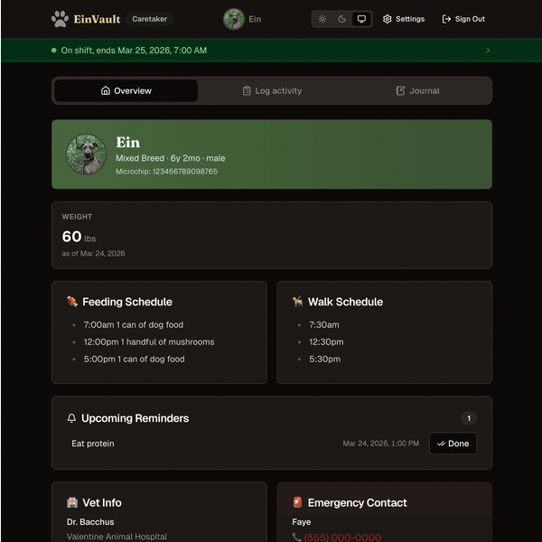
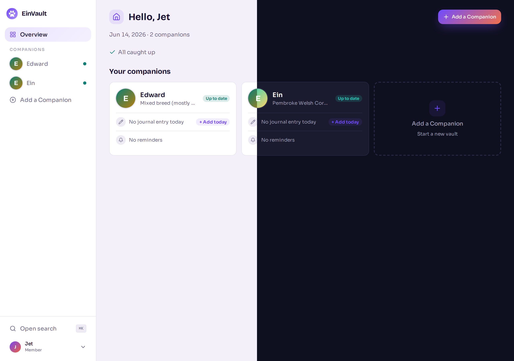
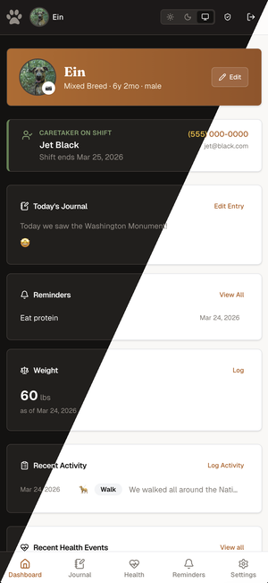
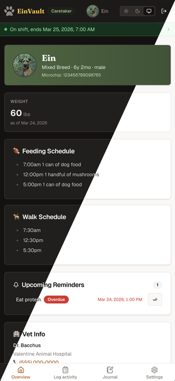

# 🐾 EinVault

[](LICENSE)

EinVault is a private, self-hosted companion health and care tracker built for homelabs. Track health records, daily activities, and care schedules for your animal companions. All data stays on your hardware. No cloud, no telemetry, no external accounts.

## Contents

- [Features](#features)
- [Screenshots](#screenshots)
- [Production (Docker)](#production-docker)
  - [Reverse proxy](#reverse-proxy)
  - [Other options](#other-options)
  - [Data and backup](#data-and-backup)
  - [Container hardening](#container-hardening)
  - [Image tags](#image-tags)
- [Docker (local build)](#docker-local-build)
- [Local development](#local-development)
  - [Commands](#commands)
- [User management](#user-management)
- [Stack](#stack)
- [License](#license)

## Features

- **Companion profiles:** breed, bio, vet info, emergency contacts, and avatar photo
- **Daily journal:** per-companion entries with mood tracking and up to 5 photos per day
- **Health tracking:** vet visits, vaccinations, medications, procedures, and weight history
- **Activity logging:** walks, meals, bathroom trips, treats, play sessions, and grooming
- **Reminders:** recurring and one-time reminders for medications, vaccinations, grooming, and more
- **Caretaker shifts:** schedule work shifts and export to calendar via iCalendar (.ics)
- **Role-based access:** admins manage the app, members track health, caretakers log activities
- **Self-contained:** single Docker container, SQLite database, no external dependencies
- **Localization:** English, German, Spanish, French, Italian, and Portuguese (non-English translations are AI-generated and may contain errors)
- **Responsive UI:** works on desktop and mobile, with dark and light mode support

## Screenshots

### Caretaker Dashboard



### Member Dashboard



| Member Dashboard (mobile)                                                       | Caretaker Dashboard (mobile)                                                          |
| ------------------------------------------------------------------------------- | ------------------------------------------------------------------------------------- |
|  |  |

[More screenshots](docs/SCREENSHOTS.md)

---

## Production (Docker)

Requires Docker Engine 24+, Docker Compose v2, and a reverse proxy for TLS (Caddy, Nginx, Traefik, or similar).

Download [`docker-compose.prod.yml`](docker-compose.prod.yml) and set your domain before starting:

**`ORIGIN`** — your public domain:

```yaml
ORIGIN: https://einvault.yourdomain.com
```

Then:

```bash
mkdir -p ./data
docker compose -f docker-compose.prod.yml up -d
```

Open your domain and follow the `/setup` prompt to create your admin account.

### Reverse proxy

The compose file defaults to `127.0.0.1:3000` for a proxy running on the host (Option A). If your proxy runs as a Docker container, switch to Option B — the comments in the compose file cover both.

**Caddy (Option A):**

```caddyfile
einvault.yourdomain.com {
    reverse_proxy 127.0.0.1:3000
}
```

**Nginx (Option A):**

```nginx
server {
    listen 443 ssl;
    server_name einvault.yourdomain.com;

    location / {
        proxy_pass http://127.0.0.1:3000;
        proxy_set_header Host $host;
        proxy_set_header X-Real-IP $remote_addr;
        proxy_set_header X-Forwarded-For $proxy_add_x_forwarded_for;
        proxy_set_header X-Forwarded-Proto $scheme;
    }
}
```

**Traefik static file provider (Option A):**

```yaml
# /etc/traefik/conf.d/einvault.yml
http:
  routers:
    einvault:
      rule: 'Host(`einvault.yourdomain.com`)'
      entryPoints: [websecure]
      tls:
        certResolver: letsencrypt
      service: einvault
  services:
    einvault:
      loadBalancer:
        servers:
          - url: 'http://127.0.0.1:3000'
```

**Traefik Docker provider (Option B)** - add these labels to the `einvault` service in the compose file:

```yaml
labels:
  - 'traefik.enable=true'
  - 'traefik.http.routers.einvault.rule=Host(`einvault.yourdomain.com`)'
  - 'traefik.http.routers.einvault.entrypoints=websecure'
  - 'traefik.http.routers.einvault.tls.certresolver=letsencrypt'
  - 'traefik.http.services.einvault.loadbalancer.server.port=3000'
```

**Caddy Docker provider (Option B):**

```caddyfile
einvault.yourdomain.com {
    reverse_proxy einvault:3000
}
```

### Other options

Everything else in the compose file can be edited directly:

|                   | Default             | Description                                                                                                                              |
| ----------------- | ------------------- | ---------------------------------------------------------------------------------------------------------------------------------------- |
| `TZ`              | `UTC`               | Container timezone. Set to your local timezone (e.g. `America/New_York`, `Europe/London`) so dates and times display correctly.          |
| `BODY_SIZE_LIMIT` | `10M`               | SvelteKit's internal body cap. Without this, uploads are limited to 512KB. Raise together with `UPLOAD_MAX_MB` if you need larger files. |
| `UPLOAD_MAX_MB`   | `10`                | App-level upload size limit in MB. Raise `BODY_SIZE_LIMIT` to match.                                                                     |
| `user`            | `1000:1000`         | UID:GID the container runs as. Change if your `./data` directory has different ownership.                                                |
| `./data` volume   | `./data`            | Where the database and uploads are stored on the host.                                                                                   |
| `DATABASE_URL`    | `/data/einvault.db` | Database path inside the container. Unlikely to need changing.                                                                           |

### Data and backup

Data lives in `./data` next to the compose file. Back it up by copying the directory:

```bash
cp -r ./data ./data.bak

# Or use SQLite's online backup while the container is running
docker exec einvault sqlite3 /data/einvault.db ".backup '/data/einvault.backup.db'"
```

### Container hardening

|                     |                               |
| ------------------- | ----------------------------- |
| Runs as root        | No (runs as `node`, UID 1000) |
| `no-new-privileges` | Enabled                       |
| Linux capabilities  | All dropped                   |
| Root filesystem     | Read-only                     |
| Writable `/tmp`     | tmpfs, 64 MB                  |
| CPU limit           | 0.5 cores                     |
| Memory limit        | 256 MB                        |

### Image tags

| Tag      | Description           |
| -------- | --------------------- |
| `latest` | Latest stable release |
| `x.y.z`  | Pinned release        |

---

## Docker (local build)

Builds the image locally instead of pulling from GHCR. Useful for testing Dockerfile changes or working on EinVault itself:

```bash
docker compose -f docker-compose.dev.yml up -d --build
```

All the same env vars work here. `ORIGIN` defaults to `http://localhost:3000` so no `.env` is needed for a basic smoke test.

---

## Local development

Requires Node.js 20+, npm 10+, and the native build tools for `better-sqlite3` and `sharp`:

- Debian/Ubuntu: `sudo apt install python3 g++ make`
- macOS: `brew install python3` (Xcode Command Line Tools provides g++ and make)

```bash
npm install
npm run db:generate   # generate migration files from the schema
npm run db:migrate    # apply migrations
npm run dev           # http://localhost:5173
```

No `.env` needed. The database defaults to `./data/einvault.db` and migrations run on startup. Open `http://localhost:5173` and you'll land on `/setup` to create your admin account.

### Commands

```bash
npm run dev            # dev server at http://localhost:5173
npm run build          # production build
npm run check          # SvelteKit type checking
npm run lint           # ESLint + Prettier check
npm run format         # auto-format with Prettier
npm run db:generate    # generate a migration file after schema changes
npm run db:migrate     # apply pending migrations
npm run db:studio      # Drizzle Studio (visual database browser)
```

When you change `src/lib/server/db/schema.ts`, run `db:generate` then `db:migrate` and commit both files together.

---

## User management

- First run redirects to `/setup` to create the initial admin account (one-time only)
- Manage users at `/admin/users`: create accounts, reset passwords, deactivate users
- No open registration

---

## Adding a new locale

1. Copy `src/lib/i18n/en.ts` to `src/lib/i18n/{code}.ts` (e.g. `ja.ts`) and translate every value. The file must `export default { ... } satisfies Record<keyof Messages, string>` — the compiler will catch any missing keys.
2. In `src/lib/i18n/index.ts`: import the new file, add the code to the `Locale` type, `SUPPORTED_LOCALES`, `LOCALE_LABELS`, and `catalogs`.
3. In `src/lib/server/db/schema.ts`: add the code to the `locale` enum on the `users` table.

No migration is needed — SQLite text columns don't enforce enums at the database level.

> **Note:** Non-English translations were generated by Claude (Anthropic) and may contain errors. Corrections via pull request are welcome.

---

## Stack

- **SvelteKit:** full-stack TypeScript framework with file-based routing
- **SQLite + Drizzle ORM:** local-first, portable database
- **Tailwind CSS:** utility-first styling with custom components
- **Session-based auth:** custom sessions signed with bcryptjs, no third-party auth library
- **Docker:** multi-stage, hardened single-container deployment

---

## License

MIT. See [LICENSE](LICENSE).
